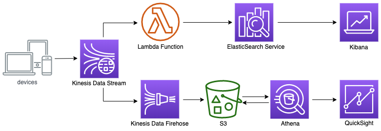

### Architecture


### 전체 과정
 - Kinesis Firehose 및 s3 버킷 생성
 - KFH를 이용해서 데이터 넣기
 - Athena 데이터베이스 및 테이블 생성
 - (optional) Glue를 이용한 스키마 변경
 - (optional) Athena를 이용한 작은 파일들 머지하는 작업
 - QuickSight에서 Athena 데이터 읽어서 보여주기 (?)
 - ElasticSearch 클러스터 생성하기
 - Lambda function을 이용해서 Elasticsearch에 넣기
 - Kibana에서 쿼리해보기
 - Kibana에서 dashboard 만들어 보기
 
### 준비 작업
실습을 시작 하기 전에 필요한 IAM User, EC2를 생성하고 및 구성합니다.
 - [사전 준비 작업](prerequisites.md)
 - 필요한 IAM Role과 security group을 생성

### Kinesis Data Streams 생성
AWS Management Console에서 Kinesis 서비스를 선택합니다.
1. **Get Started** 버튼을 클릭합니다.
2. **\[Create data stream\]** 버튼을 클릭합니다.
3. Kinesis stream name 을 입력합니다. (uk-online-retail-trans)
4. Number of shards 에 shards 수를 입력합니다.
5. **\[Create data stream\]** 버튼을 클릭 후, 생성된 kinesis stream의 status가 active가 될 때까지 기다립니다.

Kinesis 스트림 생성 버튼 클릭
### Kinesis Firehose 생성
Kinesis Firehose를 이용해서 실시간으로 데이터를 S3, Redshift, ElasticSearch 등의 목적지에 수집할 수 있습니다.
AWS Management Console에서 Kinesis 서비스를 선택합니다.

1. Get Started 버튼을 클릭합니다.
2. Deliver streaming data with Kinesis Firehose delivery streams 메뉴의 Create delivery stream 을 클릭하여
새로운 Firehose 전송 스트림 생성을 시작합니다.
3. Delivery stream name에 Source 를 입력합니다.
4. **Choose a source** 에서 `Direct PUT or other sources` 를 선택한 뒤, **Next**를 클릭합니다.
5. **Transform source records with AWS Lambda / Convert record format** 은 default인 `Disabled`로 두고 **Next**를 클릭합니다.
6. Destination은 Amazon S3를 선택하고, `Create new` 를 클릭해서 S3 bucket을 생성합니다. 
    S3 prefix를 입력합니다. (참고: https://docs.aws.amazon.com/firehose/latest/dev/s3-prefixes.html)
    예를 들어서 다음과 같이 입력 합니다.
    ```buildoutcfg
    00-retail-trans/year=!{timestamp:yyyy}/month=!{timestamp:MM}/day=!{timestamp:dd}/hour=!{timestamp:HH}/
    ```
    S3 error prefix를 입력합니다.
    예를 들어서 다음과 같이 입력 합니다.
    ```buildoutcfg
    00-error/year=!{timestamp:yyyy}/month=!{timestamp:MM}/day=!{timestamp:dd}/hour=!{timestamp:HH}/!{firehose:error-output-type}
    ```
    S3 prefix와 3 error prefix 입력을 완료한 후에, Next를 클릭합니다.
7. (Step 4: Configure settings) S3 buffer conditions에서 Buffer size는 1MB, Buffer interval은 60 seconds로 설정합니다.
8. 아래 IAM role에서 Create new, or Choose 버튼을 클릭합니다.
9. 새로 열린 탭에서 필요한 정책이 포함된 IAM 역할 firehose_delivery_role을 자동으로 생성합니다. Allow 버튼을 클릭하여 진행합니다.
10. 새롭게 생성된 역할이 추가된 것을 확인한 뒤 Next 버튼을 클릭합니다.
11. (Step 5: Review) Review에서 입력한 정보를 확인한 뒤 틀린 부분이 없다면 Create delivery stream 버튼을 클릭하여 Firehose 생성을 완료합니다.

\[[Top](#Top)\]

### 데이터를 Kinesis Firehose를 이용해서 수집하기
생성한 Firehose가 정상적으로 데이터를 수집하는지 확인해봅니다.
1. 앞서 생성한 EC2 인스턴스에 SSH 접속을 합니다.
2. gen_kinesis_data.py을 실행합니다.
    ```shell script
    $ python3 gen_kinesis_data.py --help
    usage: gen_kinesis_data.py [-h] [-I INPUT_FILE] [--out-format {csv,tsv,json}]
                               [--service-name {kinesis,firehose}]
                               [--stream-name STREAM_NAME] [--max-count MAX_COUNT]
                               [--dry-run]
    
    optional arguments:
      -h, --help            show this help message and exit
      -I INPUT_FILE, --input-file INPUT_FILE
                            The input file path ex)
                            ./resources/online_retail_II.csv
      --out-format {csv,tsv,json}
      --service-name {kinesis,firehose}
      --stream-name STREAM_NAME
                            The name of the stream to put the data record into.
      --max-count MAX_COUNT
                            The max number of records to put.
      --dry-run
    
    $ python3 gen_kinesis_data.py -I resources/online_retail_II.csv \
    --service-name firehose \
    --out-format json \
    --stream-name uk-online-retail-trans
    ```
3. 매 초 데이터가 발생하는 것을 확인합니다. 충분한 데이터 수집을 위해 실행 중인 상태로 다음 단계를 진행합니다.
4. 몇 분 뒤 생성한 S3 bucket에 가보면 생성된 원본 데이터가 Firehose를 통해 S3에 저장되는 것을 확인할 수 있습니다. 

### Athena 테이블 생성
Amazon Athena를 이용해서 S3에 저장된 데이터를 기반으로 테이블을 만들고, 테이블을 쿼리한 다음 쿼리 결과를 확인할 수 있습니다.
먼저 데이터를 쿼리하기 위해서 데이터베이스를 생성합니다.

##### 1단계 데이터베이스 생성
1. Athena 콘솔을 엽니다.
2. Athena 콘솔을 처음 방문하면 시작하기 페이지로 이동합니다. **\[Get Started\]** 를 선택해 쿼리 편집기를 엽니다. 
처음 방문하는 경우가 아니라면 Athena 쿼리 편집기가 열립니다.
3. Athena 쿼리 편집기에서 예제 쿼리가 있는 쿼리 창을 볼 수 있습니다. 쿼리 창의 아무 곳에나 쿼리를 입력하기 시작합니다.
4. **mydatabase** 라는 데이터베이스를 생성하려면 다음 CREATE DATABASE 문을 입력한 다음, **\[Run Query\]** 를 선택합니다.
    ```buildoutcfg
    CREATE DATABASE mydatabase
    ```
5. 카탈로그 디스플레이가 새로 고쳐지고 왼쪽 **\[Catalog\]** 대시보드의 **\[DATABASE\]** 목록에 mydatabase가 표시되는지 확인합니다.

##### 2단계: 테이블 생성
1. **\[DATABASE\]** 에 `mydatabase`가 선택되었는지 확인한 후 **\[New Query\]** 를 선택합니다.
2. 쿼리 창에 다음 CREATE TABLE 문을 입력한 후 **\[Run Query\]** 를 선택합니다.
    ```buildoutcfg
    CREATE EXTERNAL TABLE `mydatabase.retail_trans`(
      `invoice` string COMMENT 'Invoice number', 
      `stockcode` string COMMENT 'Product (item) code', 
      `description` string COMMENT 'Product (item) name', 
      `quantity` int COMMENT 'The quantities of each product (item) per transaction', 
      `invoicedate` string COMMENT 'Invoice date and time', 
      `price` float COMMENT 'Unit price', 
      `customer_id` string COMMENT 'Customer number', 
      `country` string COMMENT 'Country name')
    PARTITIONED BY ( 
      `year` int, 
      `month` int, 
      `day` int, 
      `hour` int)
    ROW FORMAT SERDE 
      'org.openx.data.jsonserde.JsonSerDe' 
    STORED AS INPUTFORMAT 
      'org.apache.hadoop.mapred.TextInputFormat' 
    OUTPUTFORMAT 
      'org.apache.hadoop.hive.ql.io.IgnoreKeyTextOutputFormat'
    LOCATION
      's3://aws-analytics-immersion-day-2020-apne2/00-retail-trans'
    ```
    테이블 retail_trans가 생성되고 데이터베이스의 **\[Catalog\]** 대시보드에 표시됩니다.
3. 테이블을 생성한 이후 **\[New Query(새 쿼리)\]** 를 선택하고 다음을 실행해서, 파티션의 데이터를 로드합니다.
    ```buildoutcfg
    MSCK REPAIR TABLE mydatabase.retail_trans
    ```

##### 3단계: 데이터 쿼리
1. **\[New Query\]** 를 선택하고 쿼리 창의 아무 곳에나 다음 문을 입력한 다음 **\[Run Query\]** 를 선택합니다.
    ```buildoutcfg
    SELECT *
    FROM retail_trans
    LIMIT 10
    ```
다음과 같은 형식의 결과가 반환됩니다.


### Amazon Elasticsearch Service(Amazon ES)
실시간으로 데이터를 저장하고, 분석하기 위해서 Elasticsearch cluster를 생성합니다.
Amazon ES 도메인은 Elasticsearch 클러스터와 동의어입니다. 도메인은 설정, 인스턴스 유형, 인스턴스 수, 스토리지 리소스를 지정한 설정입니다.

**Amazon ES 도메인을 만들려면(콘솔)**
1. https://aws.amazon.com으로 이동하여 Sign In to the Console(콘솔에 로그인)을 선택합니다.
2. **Analytics**에서 **Elasticsearch** 서비스를 선택합니다.
3. (Step 1: Choose deployment type) **Create a new domain(새 도메인 생성)** 을 선택합니다.
4. **Elasticsearch 도메인 생성** 페이지에서 **Deployment type(배포 유형)** 에 대해 **Production(프로턱션)** 을 선택합니다.
5. **버전**에서 해당 도메인의 Elasticsearch 버전을 선택합니다. 지원되는 최신 버전을 선택하는 것이 좋습니다. 자세한 내용은 지원되는 Elasticsearch 버전 단원을 참조하십시오.
6. **\[Next\]** 를 선택합니다.
7. (Step 2: Configure domain) 도메인의 이름을 입력합니다. 이 자습서에서는 이후에 다룰 `retail`를 예제 도메인 이름으로 사용합니다.
8. **인스턴스 유형** 에서 Amazon ES 도메인의 인스턴스 유형을 선택합니다. 이 자습서에는 테스트 목적에 적합한 소용량의 경제적인 인스턴스 유형 `t2.small.elasticsearch`를 사용하는 것이 좋습니다.
9. **인스턴스 수** 에 원하는 인스턴스 수를 입력합니다. 이 자습서에서는 기본값 1을 사용합니다.
10. 스토리지 유형에서 EBS를 선택합니다.
- a. EBS volume type(EBS 볼륨 유형)에 일반용(SSD)을 선택합니다. 자세한 내용은 Amazon EBS 볼륨 유형을 참조하십시오.
- b. EBS volume size(EBS 볼륨 크기)에 각 데이터 노드용 외부 스토리지의 크기를 GiB 단위로 입력합니다. 이 자습서에서는 기본값 10을 사용합니다.
11. 지금은 **Dedicated master nodes(전용 마스터 노드), Snapshot configuration(스냅샷 구성)** 및 **Optional Elasticsearch cluster settings(선택적 Elasticsearch 클러스터 설정)** 섹션을 무시할 수 있습니다.
12. **\[Next\]** 를 선택합니다.
13. (Step 3: Configure access and security) **Network configuration(네트워크 구성)** 의 경우 **VPC access** 를 선택합니다.
적절한 VPC와 subnet을 선택합니다. Security Groups으로 준비 단계에서 생성한 `es-cluster-sg`를 선택합니다.
14. 지금은 **Amazon Cognito Authentication(Amazon Cognito 인증)** 과 **Fine–grained access control** 을 disable 합니다.
15. **Access policy(액세스 정책)** 의 경우 **Domain access policy(도메인 액세스 정책)** 에서 **JSON defined access policy(JSON 정의 액세스 정책)** 선택한 다음,
**Add or edit the access policy(액세스 정책 추가 또는 편집)** 에 아래와 같이 입력합니다.
    ```json
    {
      "Version": "2012-10-17",
      "Statement": [
        {
          "Effect": "Allow",
          "Principal": {
            "AWS": "*"
          },
          "Action": [
            "es:Describe*",
            "es:List*",
            "es:Get*",
            "es:ESHttp*"
          ],
          "Resource": "arn:aws:es:::domain/retail/*"
        }
      ]
    }
    ```
16. **Encryption(암호화)** 에서 **Require HTTPS for all traffic to the domain** 만 허용하고, 다른 항목은 disable 합니다.
17. **Encryption(암호화)** 의 모든 기본값을 유지합니다.
18. **\[Next\]** 를 선택합니다.
19. **Review** 페이지에서 도메인 구성을 검토한 다음 **확인**을 선택합니다.

### AWS Lambda
Lambda function을 이용해서 Amazon ES에 데이터를 실시간으로 색인할 수 있습니다.
이번 실습에서는 AWS Lambda 콘솔을 사용하여 Lambda 함수를 생성합니다.

##### Lambda 함수에서 사용할 공통 라이브러를 Layers에 추가하려면,
1. **AWS Lambda 콘솔** 을 엽니다.
2. **Layers** 메뉴에 들어가서 **\[Create layer\]** 을 선택합니다.
3. Name에 `es-lib` 를 입력합니다.
4. `Upload a file from Amazon S3` 를 선택하고, 라이브러리 코드가 저장된 s3 link url을 입력합니다.
5. `Compatible runtimes` 에서 `Python 3.8` 을 선택합니다.

##### Lambda 함수를 생성하려면,
1. **AWS Lambda 콘솔** 을 엽니다.
2. **\[Create a function\]** 을 선택합니다.
3. Function name(함수 이름)에 `UpsertToES` 을 입력합니다.
4. Runtime 에서 `Python 3.8` 을 선택합니다.
5. **\[Create a function\]** 을 선택합니다.
6. Designer(디자이너) 에서 layers를 선택합니다. Layers에서 Add a layer를 선택합니다.
7. Layer selection에서 Compatiable layers에서 Name과 Version으로 앞서 생성한 layer의 Name과 Version을 선택합니다.
8. **\[Add\]** 클릭합니다.
9. Designer(디자이너) 에서 `UpsertToES` 을 선택하여 함수의 코드 및 구성으로 돌아갑니다.
10. **\[Add trigger\]** 를 선택합니다.
11. **Trigger configuration** 에서 Kinesis를 선택 합니다.
12. Kinesis stream 에서 앞서 생성한 Kinesis Data Stream을 선택합니다.
13. **\[Add\]** 를 선택합니다.
14. Function code의 코드 편집기에 `upsert_to_es.py` 파일의 코드를 복사해서 붙여넣습니다.
15. Environment variables 에서 **\[Edit\]** 를 클릭합니다.
16. **\[Add environment variables\]** 를 클릭해서 아래 4개의 Environment variables을 등록합니다.
    ```shell script
    ES_HOST=<elasticsearch service domain>
    REQUIRED_FIELDS=Invoice,StockCode,Customer_ID
    REGION_NAME=<region-name>
    DATE_TYPE_FIELDS=InvoiceDate
    ```
    예를 들어, 다음과 같이 Environment variables을 설정합니다.
    ```buildoutcfg
    ES_HOST=vpc-retail-xkl5jpog76d5abzhg4kyfilymq.us-east-1.es.amazonaws.com
    REQUIRED_FIELDS=Invoice,StockCode,Customer_ID
    REGION_NAME=us-east-1
    DATE_TYPE_FIELDS=InvoiceDate
    ```
17. **\[Save\]** 선택합니다.
18. VPC 항목에서 Elasticsearch service의 도메인을 생성한 VPC와 subnets을 선택하고, Elasticsearch service 도메인에 접근이 허용된
security groups을 선택합니다.
19. Basic settings에서 **\[Edit\]** 선택합니다.
20. Memory와 Timeout을 알맞게 조정합니다. 이번 실습에서는 Timout을 `5 min` 으로 설정합니다.

### Amazon Quicksight
이번에는 Amazon Quicksight를 통해 데이터를 시각화 해 보도록 하겠습니다.
1. Quicksight 콘솔로 이동합니다. https://quicksight.aws.amazon.com 
2. Quicksight에 가입하기 위해 Sign up for QuickSight 버튼을 클릭합니다.
3. Standard Edition을 선택한 후 Continue버튼을 클릭합니다.
4. Quicksight account name은 임의로 지정(중복될 경우 계정이 생성되지 않습니다) 하고 Notification email address는 개인 Email 주소를 입력합니다. QuckSight가 S3에 Access해야 하므로, Choose S3 buckets를 클릭하여 `aws-analytics-immersion-day-2020-apne2` 를 선택한 후 Finish를 클릭합니다.
5. 계정이 생성된 후 Go to Amazon Quicksight 버튼을 클릭합니다.
6. 좌측 상단 New Analysis를 클릭합니다.
7. New Data Set 버튼을 클릭합니다.
8. Athena를 클릭하고 팝업 창의 Data source name에 `uk-retail-quicksight` 를 입력(임의의 값 입력 가능)하고 Create data source버튼을 클릭합니다.
9. Choose your table에서 Database는 `XXXX`, Tables는 `retail-json` 를 선택하고 Select 버튼을 클릭합니다.
10. Visualize 버튼을 클릭한 후 `retail-json` 테이블 데이터가 Quicksight SPICE 엔진에 로딩 되었는지 확인합니다.
11. InvoicdDate 별 Quantity를 시각화 해 보겠습니다. 좌측 Fields list에서 invoicedate, quantity field를 차례대로 클릭합니다. Visual types는 세로 막대 그래프를 선택합니다.
12. 그래프 상단 invoicedate 를 클릭하고 Aggregate: Day를 Quarter로 변경합니다.
13. 분기별로 데이터가 집계 되었습니다.
14. 방금 만든 Dashboard를 다른 사용자에게 공유해 보겠습니다. 좌측 상단 유저 아이콘을 클릭하고 Manage QuickSight를 클릭합니다.
15. Invite users 버튼을 클릭한 후 임의의 사용자 계정명(BI_user01)을 입력한 후 우측 [+] 버튼을 클릭합니다. Email은 다른 사용자의 Email 주소를 입력하고 Role은 AUTHOR, IAM User는 NO를 선택한 후 Invite 버튼을 클릭합니다.
16. 사용자는 다음과 같은 Invitation Email을 받고 Click to accept invitation을 클릭하면 계정 생성 메뉴에서 비밀번호를 변경할 수 있습니다.
17. QuickSight 화면으로 돌아가서 우측 상단의 Share > Share analysis를 클릭합니다.
18. BI_user01을 선택한 후 Share 버튼을 클릭합니다.
19. 사용자는 다음과 같은 Email을 수신합니다. Click to View를 클릭하여 분석결과를 확인할 수 있습니다.
